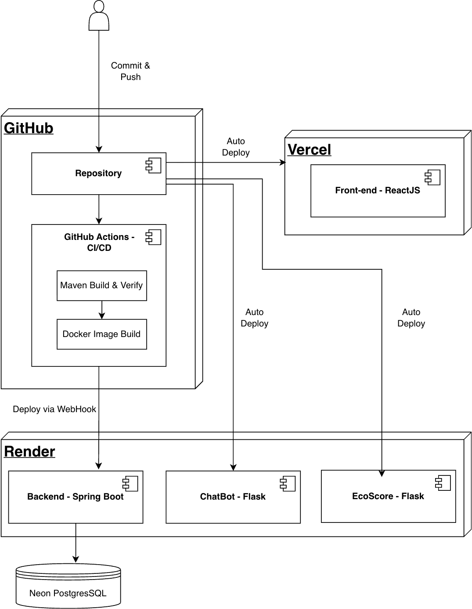

# Shopit.now - AI-Driven Sustainable E-Commerce Platform

1. [Chatbot-Service](https://github.com/DevelopedBy-Siva/ecom-chat-bot)
2. [Sustainability-service](https://github.com/DevelopedBy-Siva/shopitnow-sustainability-tracker.git)

---

Shopit.now is a full-stack e-commerce platform that integrates **AI-powered sustainability intelligence** to help users make greener purchasing decisions.  
It features a **Cart Optimizer** that recommends eco-friendly product alternatives, predicting environmental impact and reducing the simulated carbon footprint per user cart by up to **35%**.

---

## Core Features

- **AI Cart Optimizer:** Recommends greener alternatives using TF-IDF similarity and predictive ML models for eco-scoring and CO₂ estimation.
- **Sustainability Insights:** Displays carbon footprint and eco-scores for every product, encouraging sustainable shopping.
- **JWT-Secured Authentication:** Implements role-based access with Spring Security (Admin / User).
- **Integrated Chatbot Assistant:** Built with PyTorch intent classification for real-time user support and guidance.
- **Admin Portal:** Enables product management
- **Containerized Microservices:** Spring Boot (Core Service) + Flask (AI/ML & Chatbot Services).
- **CI/CD Automation:** Continuous deployment via GitHub Actions and Render Cloud.
- **Monitoring:** Prometheus integration for metrics and performance monitoring.

---

## Overview

---

**Backend:**

- Java (Spring Boot) — Core business logic & JWT authentication
- Python (Flask) — Sustainability & AI services
- PyTorch, Scikit-learn, Pandas — ML modeling
- PostgreSQL — Relational data store
- Docker — Containerization & environment consistency

**Frontend:**

- React.js + Redux — Responsive client app
- RESTful API integration via Axios

**DevOps & Monitoring:**

- Docker, Render Cloud — CI/CD & deployment
- GitHub Actions — Automated builds & tests
- Prometheus — Service health & performance metrics

---

## Deployment Overview

| Service       | Platform | Framework   | Port |
| ------------- | -------- | ----------- | ---- |
| Core Backend  | Render   | Spring Boot | 8080 |
| AI/ML Service | Render   | Flask       | 5001 |
| Chatbot       | Render   | Flask       | 5000 |
| Frontend      | Vercel   | React.js    | 3000 |

Each backend service is independently deployed as a **microservice**, communicating over REST APIs.

---

## Security

- **JWT Authentication:** Protects API routes and enables stateless session management.
- **Role-Based Access Control:** Separate privileges for admins and users.
- **CORS Configuration:** Restricted origins for client security.

---

## Sustainability Engine Highlights

- Predicts eco-scores and emission factors using trained regression models (R² ≈ 0.97).
- Recommends greener product substitutions via TF-IDF semantic similarity.
- Tracks and compares total CO₂ impact across user carts.
- Provides quantitative sustainability insights per product and order.

---

## Example API Endpoints

| Method | Endpoint                       | Description                                      |
| ------ | ------------------------------ | ------------------------------------------------ |
| `POST` | `/api/sustainability/cart`     | Returns optimized cart recommendations           |
| `GET`  | `/api/sustainability/insights` | Provides eco-metrics and sustainability insights |
| `POST` | `/api/chat`                    | Sends a message to the chatbot                   |
| `GET`  | `/api/core/products/view`      | Fetches product listings                         |
| `POST` | `/api/core/auth/login`         | Authenticates user via JWT                       |
